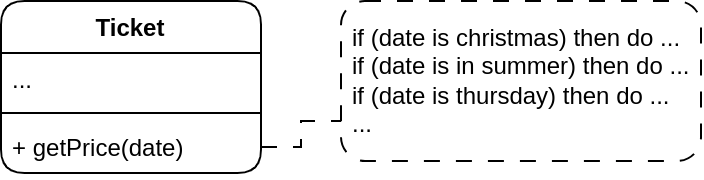
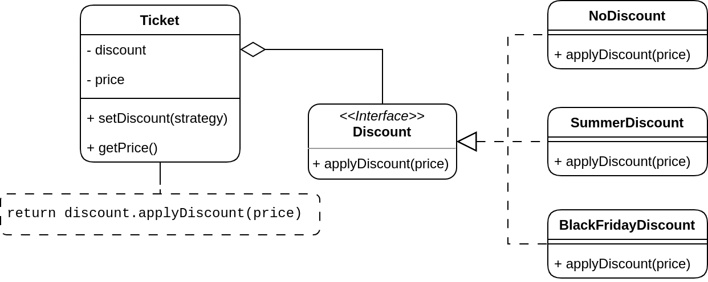
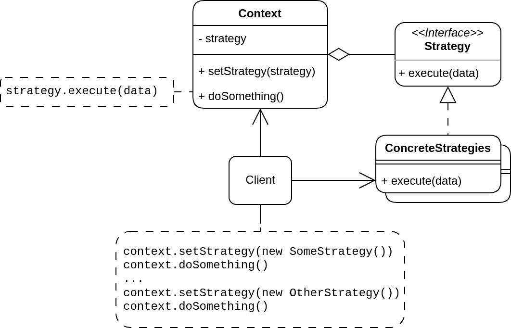

# Strategy Pattern

## Problem

Suppose that you have been hired in the startup cinema since you are graduated from college. You are in the technical team and given the task which is developing ticket structure. Most of what you have to do are not difficult to you except the get price method in the ticket.

Obviously, customers love discount, so you tend to reduce the price to half on a specific day in a week. However, you soon realise that there are enormous kinds of discount such as quarter, half or on Black Friday, Summer, Christmas, etc. Consequently, you will implement all of the discounts in the get price method of the ticket.

The problem here is that all the implementations are in one place. Your colleagues are developing with you as the same time on the same file, which causes conflicts in the merging between versions. Moreover, if one discount code is not running, you may take a lots of time figure than out which discount code is wrong to fix it. This approach violates the two first principles in SOLID principles in OOP, which are Single Responsibility Principle and Opened/Closed Principle.

## Solution

The Strategy pattern suggests that you take a class that does something specific in a lot of different ways and extract all of these algorithms into separate classes called **strategies**.

The original class, called **context**, must have a field for storing a reference to one of the strategies. The context delegates the work to a linked strategy object instead of executing it independently.

The context does not know which strategy is used. Instead, the client, which is the cinema in the above scenario, chooses the appropriate one for the context. Furthermore, the context has no idea about the amount of strategies. It works with all strategies that have an identical interface, which only exposes a single method for triggering the algorithm encapsulated within the chosen strategy.

Doing this makes the context independent of concrete strategies, so you can add more in the future without thinking about whether it runs well in the context.

Example code: [C++](code.cpp)

## Structure

## Pros and cons

### Pros

- Switch algorithms at running time.
- Isolate the implementations of an algorithm from the code that uses it.
- Replace inheritance with composition.
- Add new strategies without having to change the context.

### Cons

- Use anonymous functions instead of creating classes or interfaces.

