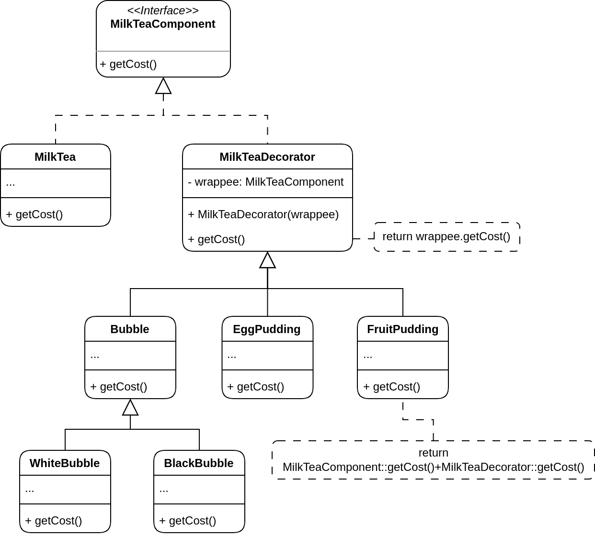

# Strategy Pattern

## Problem
Suppose that you are going to open a milk tea shop with a lot of intentions.

First, you develop the class name `MilkTea` which is the default version of milk tea that is common in other shop. There are few attributes in the class such as name, amount of sugar, ice cubes, etc, and one of methods is `getCost()`. You may figure out that customers, expecially the young generation, would like to have various toppings in the milktea such as bubbles (black or white), pudding (cheese, egg, fruit), ... You may think that a bubble milk tea *IS-A* milk tea so you create a `BubbleMilkTea` subclass which inherits from `MilkTea`. Consequently, you will develop another types of milktea by using inheritance.

As soon you realize the problem that is the enormous amount of classes in your application because of the combinations of toppings.

You might try to solve the problem by putting everything into a single class. However, it quickly became apparent that this approach will bloat the code immensely.

There is another problem which is that you change the price of individual toppings. You have to change in every combinations that has that ingredient, which is the painful task obviously.

## Solution

First thought you have is that change the object's behavior. However, inheritance has several severe issues that you need to take care of. One of the is that the behavior of on object cannot be altered in running time since inheritance is **static**.

One way you can overcome this problem by using *Composition* instead of *Inheritance*. Composition allows an object to hold a reference of other another and delegates it some work. On the other hand, the object itself *is* able to do the job by inherating from base class.

*Wrapper* is the alternative name of *Decorator* that clearly show the main idea of the pattern. A "wrapper" object has a reference to another object.
The wrapper contains identical behaviors as the target and delegates all requests that it can handle. Importantly, the wrapper **can do something** before or after calling the method of the target.

The wrapper inmplements the same interface as the wrapped object. That's why you cannot see difference between objects. Add the wrapper's reference field accept any object that follows the interface. This will let you cover an object with multiple wrappers, enhancing the behavior of the core object.

You may wrap various decorators on object `MilkTea` that match customer's preferences. This resulting objects will be structured as a stack. The last decorator in the stack would be the object that the client actually works with. Since all decorators implement the same interface as the core `MilkTea`, the rest of the client code will not have to take care of whether it works with the "pure" `MilkTea` object or a stack of decorators.

Example code: [Click me](Structural/Decorator/code.cpp)
